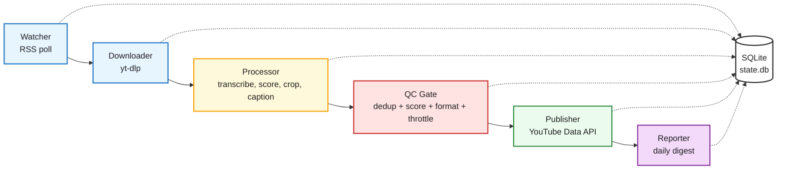

# Darija YouTube Shorts Automation

A fully free, locally-run pipeline that watches Moroccan Darija YouTube channels, downloads long-form videos, transcribes and scores them for highlights, auto-crops to 9:16, burns in Arabic captions and channel branding, and publishes Shorts to YouTube on a schedule, with a daily performance report.

No paid APIs, no cloud LLM calls. Transcription, highlight scoring, cropping, and captioning all run locally.

> **Status:** solo side project, actively being built out. Watcher, processing pipeline, QC gate, publisher, reporter, and scheduler are all implemented; production-scale reliability (see [Known issues](#known-issues)) is still being worked on. See [`docs/progress.md`](docs/progress.md) for the full build log.

## How it works



Every stage reads/writes a single SQLite database (`state.db`), so the pipeline can stop and resume anywhere without losing track of a video or clip. Full design (component responsibilities, DB schema, QC thresholds, quota math) is written up in [`docs/darija-shorts-automation-architecture.md`](docs/darija-shorts-automation-architecture.md) — that's the source of truth, this README is the tour.

## Pipeline stages

| Stage | Script | What it does |
|---|---|---|
| Watch | [`src/watcher.py`](src/watcher.py) | Polls each source channel's public RSS feed, diffs against `state.db`, queues new video IDs. No API quota spent. |
| Download | vendored `yt-dlp` wrapper | Pulls the full source video via `yt-dlp`. |
| Process | [`src/processor.py`](src/processor.py) | Orchestrates transcription (Darija Whisper fine-tune), highlight scoring (local LLM via Ollama), scene-cut-aware vertical crop, and caption + brand overlay burn-in. |
| QC gate | [`src/qc_gate.py`](src/qc_gate.py) | Rejects/holds clips on dedup, score threshold, format validation, and per-source-video / per-day throttles before anything is eligible to publish. |
| Publish | [`src/publisher.py`](src/publisher.py) | Uploads the highest-scoring queued clip via `videos.insert`, tracking YouTube API quota and halting (not retry-looping) on repeated failures. |
| Report | [`src/reporter.py`](src/reporter.py) | End-of-day digest at `reports/{date}.md` — views/likes/retention per clip, QC rejections and why, quota used. |
| Orchestrate | [`src/run_ingest.py`](src/run_ingest.py) | Runs watch → process (all queued videos) → QC gate as one cycle, the unit the scheduler actually invokes every 2-4h. |

## Built on top of, not from scratch

The download/transcribe/score/crop core is vendored from [`SamurAIGPT/AI-Youtube-Shorts-Generator`](https://github.com/SamurAIGPT/AI-Youtube-Shorts-Generator) (MIT) at `vendor/ai-youtube-shorts-generator/` as a git submodule, patched in place for Darija:

- Highlight-scoring LLM swapped from OpenAI to a local **Ollama** model (Atlas-Chat-9B, a Gemma-2 fine-tune for Darija).
- Transcription swapped to a **Darija Whisper fine-tune** (`anaszil/whisper-large-v3-turbo-darija`), with generic `faster-whisper` as an explicit, logged fallback.
- Face-tracking crop, JSON parsing, and chunked-highlight handling are patched for real-world robustness (debounced tracking so it stops chasing false positives, tolerant JSON repair for the local model's quirks, per-chunk failure isolation on long videos).

See [CLAUDE.md](CLAUDE.md) for the full reuse-vs-new breakdown and the project's hard constraints (free/local only, non-bypassable QC gate, quota-safe retry behavior).

## Repo layout

```
src/            pipeline stage scripts (watcher, processor, qc_gate, publisher, reporter, run_ingest, db)
vendor/         git submodule: AI-Youtube-Shorts-Generator, patched in place for Darija
config/         channels.yaml (source channels), channel_profile.yaml (branding), OAuth tokens (gitignored)
scheduler/      launchd plists + install/uninstall scripts
assets/brand/   channel logo/overlay assets + generator script
docs/           architecture doc + build log (docs/progress.md)
tests/          pytest suite, one file per stage
```

`raw/`, `clips/`, `output/`, `reports/`, `state.db`, and `vendor/`'s checked-out contents are gitignored — this repo is code only, not media.

## Setup

Requires **Python 3.11+**, [`ffmpeg`](https://ffmpeg.org/) on `PATH`, and [Ollama](https://ollama.com/) running locally.

```bash
git clone --recurse-submodules <repo-url>
cd shorts-automation-darija
python -m venv .venv && source .venv/bin/activate
pip install -r requirements.txt
pip install -r vendor/ai-youtube-shorts-generator/requirements-local.txt

ollama pull hf.co/QuantFactory/Atlas-Chat-9B-GGUF:Q4_K_M
```

Then configure:

1. **`config/channels.yaml`** — source channel IDs to watch (see the checked-in example).
2. **`config/channel_profile.yaml`** — channel name, tagline, hashtags, branding assets for published clips.
3. **YouTube OAuth** — download an OAuth client secret from Google Cloud Console (YouTube Data API v3 + YouTube Analytics API enabled) to `config/youtube_client_secret.json`. First run of `publisher.py` / `reporter.py` opens a browser to authorize and caches the token — nothing here is committed (see `.gitignore`).

## Running it

```bash
# one full watch -> process -> QC cycle
python src/run_ingest.py

# publish the single highest-scoring queued clip
python src/publisher.py

# compile today's report
python src/reporter.py
```

For unattended daily operation, `scheduler/install.sh` installs three `launchd` jobs (macOS) — ingest every 2-4h, publisher roughly every 90 min, reporter once at end of day — spacing uploads out rather than posting in a burst, per the YouTube API quota budget (1,600 units/upload, 10,000/day default).

## Testing

```bash
pytest
black --check .
ruff check .
```

Each new stage script has its own test file under `tests/`, covering its core logic with all external services (Ollama, YouTube API, ffmpeg subprocess calls) mocked — the suite never hits a real network endpoint. Untouched vendor internals aren't re-tested; the Darija-specific overrides layered on top of them are.

## Known issues

- Highlight scoring occasionally fails on a chunk of longer videos (local 9B model capability limit, not a code bug) — the pipeline skips the failed chunk and keeps the rest rather than aborting the whole video, but overall per-video success rate on long videos is lower than ideal. Tracked as an open item, see `docs/progress.md`.
- RTL Arabic caption rendering has been visually spot-checked against real Darija clips and looks correct, but hasn't had a systematic verification pass across edge cases (long words, mixed Darija/French lines).

## License

Pipeline code in this repo has no license file yet (private/personal project). The vendored base repo (`vendor/ai-youtube-shorts-generator/`) is MIT-licensed by its original author.
