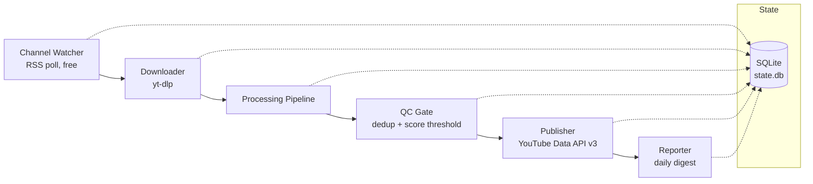
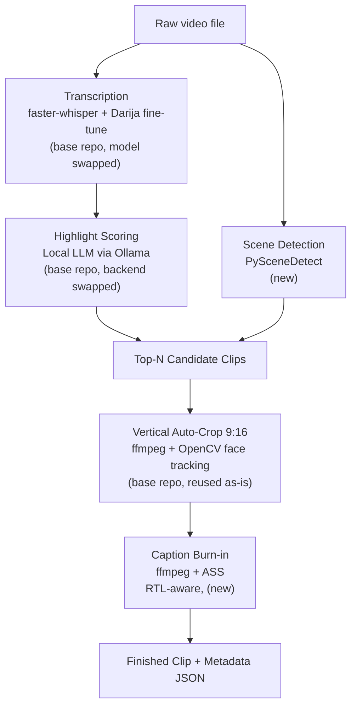
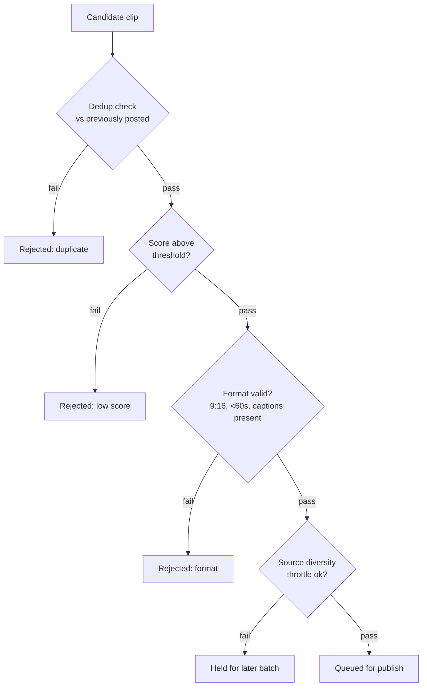
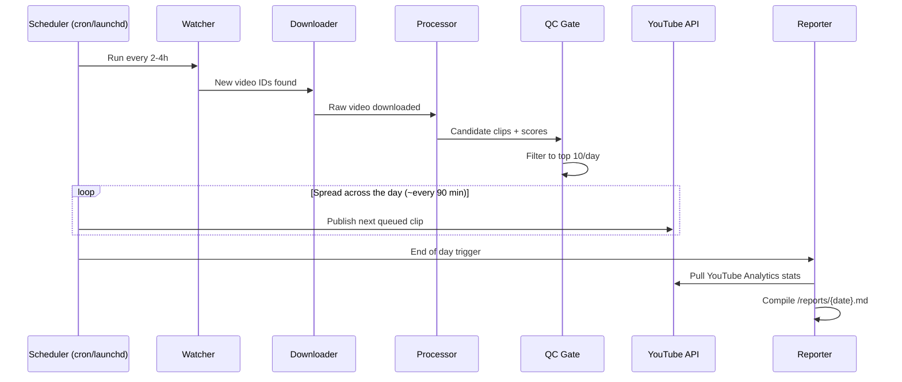
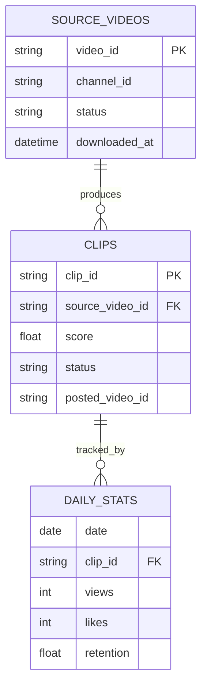

# Darija YouTube Shorts Automation — Architecture Plan

Fully free, locally-run pipeline that watches source YouTube channels, downloads long-form videos, extracts and scores highlight clips (optimized for Moroccan Darija), auto-crops/captions them, publishes ~10 Shorts/day to YouTube, and generates a daily performance report.

Built on top of the open-source **[SamurAIGPT/AI-Youtube-Shorts-Generator](https://github.com/SamurAIGPT/AI-Youtube-Shorts-Generator)** (MIT license) for the download/transcribe/score/crop core — see Section 2 for exactly what's reused vs. newly built.

> **Note:** this architecture assumes source channels you own or have explicit permission to re-clip. Repurposing third-party channels at volume without permission risks takedowns/demonetization regardless of pipeline quality.

---

## 1. High-level system overview



---

## 2. Base repository & reuse strategy

We don't build the clipping engine from scratch. We fork/vendor
**[SamurAIGPT/AI-Youtube-Shorts-Generator](https://github.com/SamurAIGPT/AI-Youtube-Shorts-Generator)**
(MIT licensed) and treat it as the core library for download → transcribe →
score → crop. Our own code is limited to the pieces that repo doesn't
provide: the watcher, QC gate, publisher, reporter, scheduler, and the
Darija/local-model swaps described below.

### What the base repo already gives us (`--mode local`)

| Base repo module | Does what we need for | Reuse as-is? |
|---|---|---|
| `shorts_generator/local/downloader.py` (`yt-dlp`) | Downloader (§3.2) | ✅ yes |
| `shorts_generator/local/transcriber.py` (`faster-whisper`) | Transcription (§3.3) | ⚠️ swap model — see below |
| `shorts_generator/highlights.py` + `shorts_generator/local/llm.py` (OpenAI chat completions) | Highlight Scoring (§3.4) | ⚠️ swap backend — see below |
| `shorts_generator/local/clipper.py` (`ffmpeg` + OpenCV face tracking) | Vertical Auto-Crop (§3.6) | ✅ yes |
| `shorts_generator/pipeline.py` | Orchestrates download→transcribe→score→crop as one call | ✅ yes, call `generate_shorts(...)` from our `processor.py` |

### Required modifications (the actual "features we add")

1. **`local/transcriber.py` → Darija transcription.** Swap the `faster-whisper`
   model load to a Darija fine-tune (`anaszil/whisper-large-v3-turbo-darija` or
   `ychafiqui/whisper-medium-darija`), with generic Whisper-large as fallback.
   This is a config/model-path change plus a fallback-detection wrapper, not a
   rewrite of the transcription flow itself.
2. **`local/llm.py` → local LLM instead of OpenAI.** The base repo's local mode
   still calls OpenAI (`OPENAI_API_KEY`, `gpt-4o-mini`) for highlight ranking —
   this is the one paid dependency in their "local" mode and must be replaced
   to stay fully free. Point this module at Ollama (Qwen2.5 7B/14B) via its
   local HTTP API instead, keeping the same input/output contract
   (`highlights.py`'s virality framework and JSON schema) so nothing downstream
   breaks.
3. **`highlights.py` prompt** — extend `HIGHLIGHT_SYSTEM_PROMPT` with Darija/
   Arabic-script framing and code-switch (Darija/French) examples so scoring
   doesn't default to MSA reasoning.
4. **Caption burn-in** is *not* in the base repo (it outputs cropped clips
   only, no captions) — this is new code we add after `clipper.py`'s output,
   using the transcript already produced upstream (§3.7).
5. **Everything from the QC gate onward** (dedup, publishing, quota
   management, reporting, scheduling, channel watching) is entirely new — the
   base repo is a single-video, on-demand clipper, not a channel-monitoring
   daily-batch system.

### Not used from the base repo

- API mode (`--mode api`, MuAPI-backed) — paid, skip entirely; we only use
  `--mode local`.
- `shorts_generator/muapi.py`, `downloader.py` (API-mode), `transcriber.py`
  (API-mode), `clipper.py` (API-mode) — all MuAPI-backed, not needed.

---

## 3. Component by component

### 3.1 Channel Watcher
- **New — not in base repo.** Polls each source channel's public RSS feed (`/feeds/videos.xml?channel_id=...`) on a schedule, diffs new video IDs against `state.db`, and enqueues them for download.
- **Why RSS, not the API:** avoids burning YouTube Data API quota just to check for new uploads — quota is reserved entirely for publishing.
- **Frequency:** every 2–4 hours is enough for most channels; tune per source based on how often they post.
- **Failure mode to watch:** RSS feeds only list the ~15 most recent uploads, so a watcher outage longer than a channel's posting cadence can silently miss videos — log last-checked timestamps per channel to catch this.

### 3.2 Downloader
- **Reused from base repo** (`shorts_generator/local/downloader.py`). Pulls the full source video (and existing auto-captions if present) via `yt-dlp`, stores it in `/raw/{video_id}.mp4`, updates status in `state.db`.
- **Optimization:** if usable subtitles already exist on the source video, skip the transcription step entirely for that video and feed the existing captions straight to highlight scoring.

### 3.3 Transcription
- **Reused with modification** (`shorts_generator/local/transcriber.py`, base repo uses `faster-whisper`). Converts audio to timestamped text.
- **Darija handling:** swap the model to a Darija fine-tune (`anaszil/whisper-large-v3-turbo-darija` or `ychafiqui/whisper-medium-darija`); fall back to generic Whisper-large if output looks garbled, which typically happens on heavy Darija/French code-switching.
- **Output:** word-level timestamped transcript JSON, used by both highlight scoring and caption burn-in later.

### 3.4 Highlight Scoring (Local LLM)
- **Reused with modification** (`shorts_generator/highlights.py` + `shorts_generator/local/llm.py`, base repo calls OpenAI). Ranks moments by hook strength, emotional peaks, quotable lines, and story arcs, returning a virality score per candidate segment.
- **Modification:** swap `local/llm.py` to call Ollama (Qwen2.5 7B/14B) instead of OpenAI — this is the base repo's one paid dependency in local mode and must go for a fully-free build.
- **Darija handling:** extend the system prompt with Darija/Arabic script framing and code-switch examples — otherwise the model tends to default to Modern Standard Arabic reasoning and misses colloquial hooks.
- **Output:** ranked list of candidate clip time ranges with scores and short "why this works" justifications.

### 3.5 Scene Detection
- **New — not in base repo** (base repo's crop step tracks faces per-frame but doesn't do independent scene-cut detection). `PySceneDetect` finds hard scene-cut boundaries independently of the transcript, so clip cuts land on clean visual edits rather than mid-shot.
- **Role in pipeline:** intersected with the LLM's candidate time ranges to snap clip start/end points to the nearest real cut.

### 3.6 Vertical Auto-Crop
- **Reused from base repo** (`shorts_generator/local/clipper.py`). `ffmpeg` + OpenCV face tracking crops to 9:16, following the subject through motion via a smoothed pan path rather than a static center-crop.
- **Why it matters:** naive center-cropping loses the speaker the moment they move; this step is what makes clips look intentionally edited rather than auto-cropped.

### 3.7 Caption Burn-in
- **New — not in base repo** (base repo's output is cropped clips with no captions). Takes the Whisper word-timestamp JSON already produced in §3.3, builds an `.ass` subtitle file styled for short-form (word-by-word highlight), and burns it into the video via `ffmpeg` as a post-processing step after `clipper.py`'s output.
- **Darija handling:** Arabic script is right-to-left — verify the `.ass` render config handles RTL correctly; this is a common silent-breakage point where captions render reversed or misaligned.

### 3.8 QC Gate
- **New — not in base repo.** The last checkpoint before a clip is eligible for publishing. See full logic in Section 5, but at a component level it owns: dedup fingerprinting, score thresholding, format validation (9:16, <60s, captions present), and source-diversity throttling so one long video doesn't flood the whole day's batch.

### 3.9 Publisher
- **New — not in base repo.** Takes the day's QC-passed queue, uploads via `videos.insert` (OAuth, `youtube.upload` scope), spaced out through the day rather than posted in a burst.
- **Constraints it manages:** quota consumption (1,600 units/upload), multi-project quota pooling if scaled past ~6/day, and retry/backoff on transient API failures.

### 3.10 Reporter
- **New — not in base repo.** Runs at end of day, pulls per-clip stats via the YouTube Analytics API, and compiles `/reports/{date}.md` — clips posted, source videos, views/retention/likes, QC rejections and why, and quota used/remaining.
- **Value:** this is the "just track the results" layer — no manual dashboard checking needed to know whether the day's batch performed.

---

## 4. Processing pipeline detail



**Darija-specific notes:**
- Transcription model options: `anaszil/whisper-large-v3-turbo-darija` (LoRA on Whisper large-v3-turbo) or `ychafiqui/whisper-medium-darija`. Fall back to generic Whisper-large if Darija output looks garbled on code-switched (Darija/French) audio.
- Prompt the local LLM in Darija/Arabic script explicitly during highlight scoring — otherwise it tends to reason in MSA.
- Verify ASS caption rendering handles right-to-left Arabic script correctly; this is a common breakage point.

---

## 5. QC gate logic



---

## 6. Daily publishing schedule (sequence view)



---

## 7. Storage schema (SQLite — `state.db`)



---

## 8. Tech stack summary

| Layer | Tool | Source | Cost |
|---|---|---|---|
| Channel watch | YouTube RSS feed (`/feeds/videos.xml?channel_id=...`) | New | Free, no quota |
| Download | `yt-dlp` | Base repo (`local/downloader.py`) | Free |
| Transcription | `faster-whisper` + Darija fine-tunes (Hugging Face) | Base repo, model swapped | Free |
| Highlight scoring | Ollama + Qwen2.5 (7B/14B) | Base repo, backend swapped (was OpenAI) | Free, local |
| Scene detection | PySceneDetect | New | Free |
| Vertical crop | OpenCV + ffmpeg face tracking | Base repo (`local/clipper.py`), reused as-is | Free |
| Captioning | ffmpeg + ASS from Whisper timestamps | New | Free |
| State/tracking | SQLite | New | Free |
| Scheduling | `cron` / `launchd` (macOS native) | New | Free |
| Publishing | YouTube Data API v3 (`videos.insert`) | New | Free (quota-limited) |
| Analytics/report | YouTube Analytics API | New | Free |

---

## 9. Quota math for 10 videos/day

- Each upload costs **1,600 quota units**.
- Default daily budget: **10,000 units ≈ 6 uploads/day**.
- To hit 10/day, either:
  - Request a **free quota increase** via Google Cloud Console, or
  - Split uploads across **multiple Google Cloud projects** (each gets its own independent 10,000-unit pool).

---

## 10. Suggested folder structure

```
darija-shorts-automation/
├── vendor/
│   └── ai-youtube-shorts-generator/   # forked base repo (MIT) — Darija-specific fixes
│       └── shorts_generator/          # (transcription model, LLM backend, face tracking,
│                                       #  highlight-chunking) are edited directly in place
├── config/
│   └── channels.yaml          # source channel IDs, thresholds
├── raw/                        # downloaded source videos
├── clips/
│   └── {video_id}/
│       ├── {clip_id}.mp4
│       └── {clip_id}.json      # score, transcript, metadata
├── reports/
│   └── {date}.md
├── state.db                    # SQLite tracking DB
├── src/                         # all pipeline stage scripts, sibling-importable
│   ├── watcher.py               # new
│   ├── processor.py             # new — calls vendor's generate_shorts(), then adds scene detection + captions
│   ├── qc_gate.py                # new
│   ├── publisher.py              # new
│   ├── reporter.py               # new
│   └── db.py                    # new — state.db connection helper
├── docs/                        # architecture doc, progress notes
├── conftest.py                  # pytest path setup (stays at repo root — must be an ancestor of tests/)
├── CLAUDE.md                    # stays at repo root — required by tooling
└── scheduler/                  # launchd plist or crontab entries
```

---

## 11. Scaling path (still free)

| Growth stage | Change needed |
|---|---|
| 10 → 20+ clips/day | Request larger YouTube quota, or add a second Google Cloud project |
| More source channels | Add channel IDs to `channels.yaml`; watcher scales automatically |
| Faster turnaround | Run processing overnight so the day's batch is ready by morning |
| Other platforms | Layer in Postiz (self-hosted, free) for TikTok/Reels/Facebook once each platform's app review is complete |
| Reliability at scale | Move from cron/launchd to Celery + local Redis for retries/failure handling |
